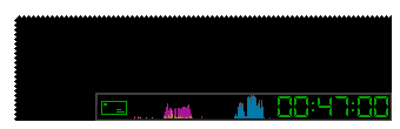

This is a simple non-interactive indicator panel for OpenBox, a small widget that displays digital clock and some bits of system state in the bottom right corner of the screen.

Current set of indicators:

  * clock
  * system load
  * battery charge
  * network traffic
  * mailbox status.

Unlike tint2, this is neither a taskbar nor a launcher. If configured properly, OpenBox does not really need either. 

The panel is not configurable in the usual sense. If it does not fit a particular system, it should be modified or re-written completely.

There is now a very limited systray area support, mostly for Wine because its floating tray is very annoying.

The design was originally (~2008, maybe earlier) based on the IceWM taskbar.
